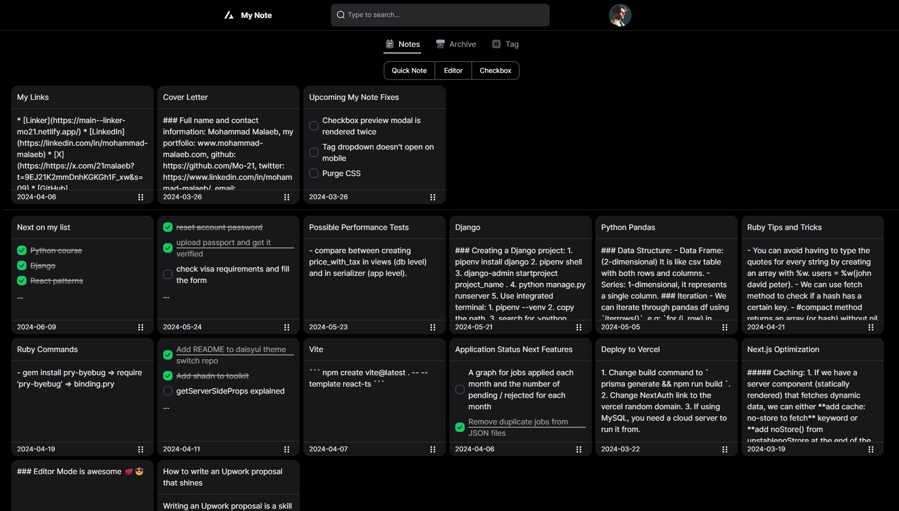
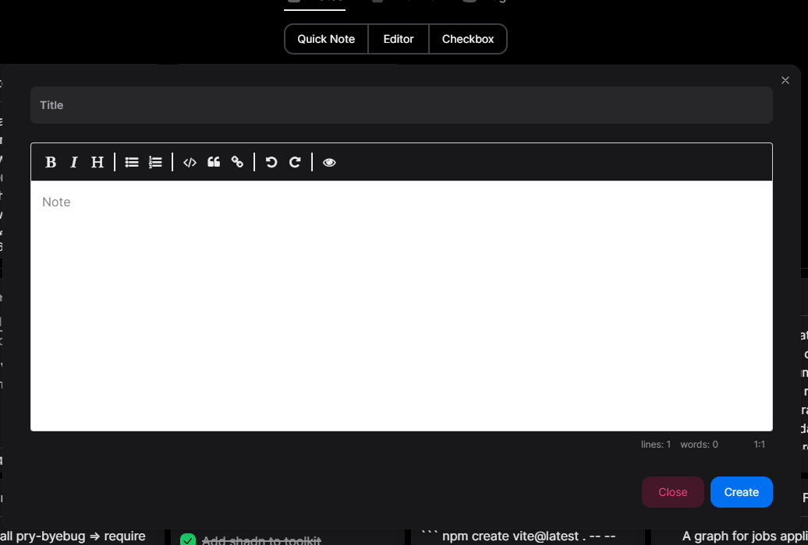
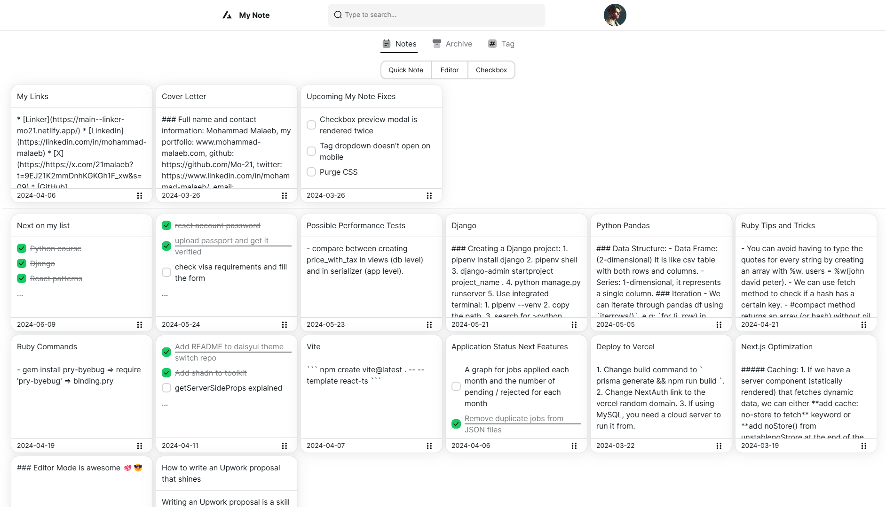
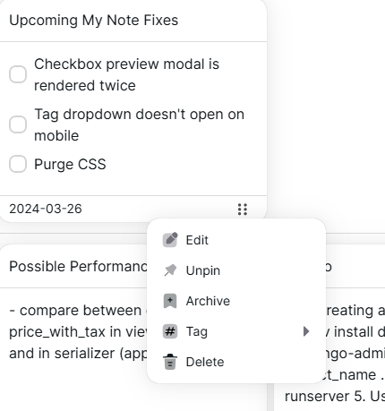

# My Note

My Note is a dynamic and feature-rich note-taking application built with modern web technologies including Next.js 14, TypeScript, NextAuth, NextUI, React Query for data fetching and state management, and Prisma. This application allows users to effortlessly create, edit, delete, pin, archive, and tag their notes. With the seamless integration of React Query's optimistic updates, all actions are reflected instantly in the UI without a single page refresh, providing a smooth and responsive user experience.



## Features

- **User Authentication**: Secure registration, login, and logout functionality powered by NextAuth.
- **Note Management**: Users can create, edit, and delete notes.
- **Note Pinning**: Important notes can be pinned to the top for easy access.
- **Note Archiving**: Less relevant notes can be archived to keep the workspace clean.
- **Note Tagging**: Notes can be tagged for efficient organization and retrieval.
- **Optimistic Updates**: Leveraging React Query's `onMutate` for instant UI updates without waiting for server confirmation.

### Different Note Types

The note can be created with:

1. Quick Note: a plain text note with no support for any markdown elements. It is meant to be simple, quick and efficient.
2. Editor: thanks to `react-simplemde-editor`, a note can be styled with full fledge of styles and tools, such as: code, ordered lists, unordered lists, heading, bold and much more.
3. Checkbox: a todo like note with nice checkboxes from NextUI with smooth experience.



### Change Theme

With the usage of `next-themes` package, My Note features a change theme switch to toggle between the dark and light mode:

```
    <Switch
        isSelected={isDarkMode}
        size="sm"
        color="success"
        checked={isDarkMode}
        onChange={toggleTheme}
      />
```



### Note Dropdown

Each note has number of actions:

1. pin/unpin
2. edit
3. delete
4. archive
5. tag (a nested dropdown) to choose a tag from list of tags



## Technologies Used

- **[Next.js 14](https://nextjs.org/)**: The React framework for production.
- **[TypeScript](https://www.typescriptlang.org/)**: Superset of JavaScript that adds static types.
- **[NextAuth](https://next-auth.js.org/)**: Authentication for Next.js.
- **[NextUI](https://nextui.org/)**: Beautiful, modern, and fast React UI library.
- **[React Query](https://tanstack.com/query/v4)**: Powerful data synchronization for React.
- **[Prisma](https://www.prisma.io/)**: Next-generation ORM for Node.js and TypeScript.
